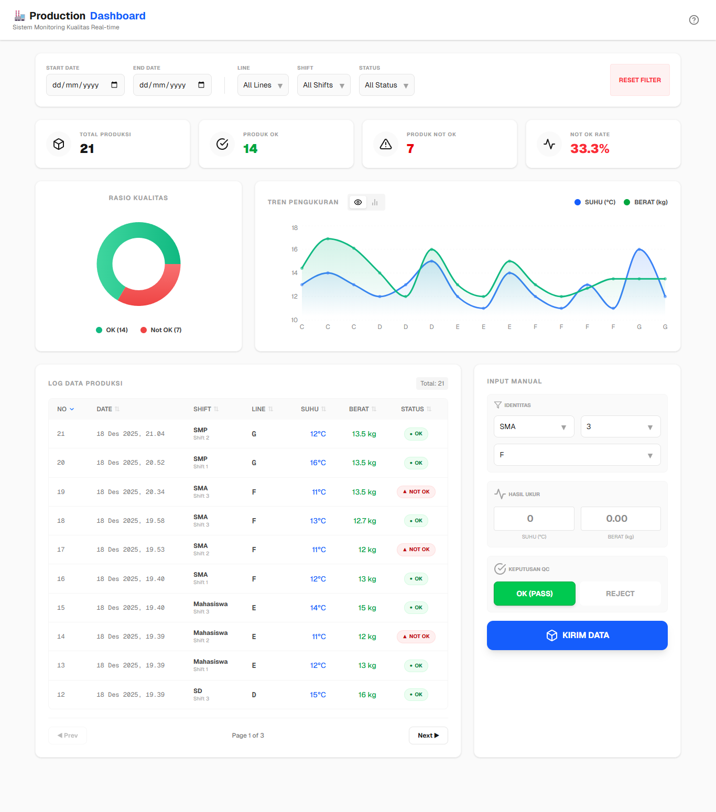
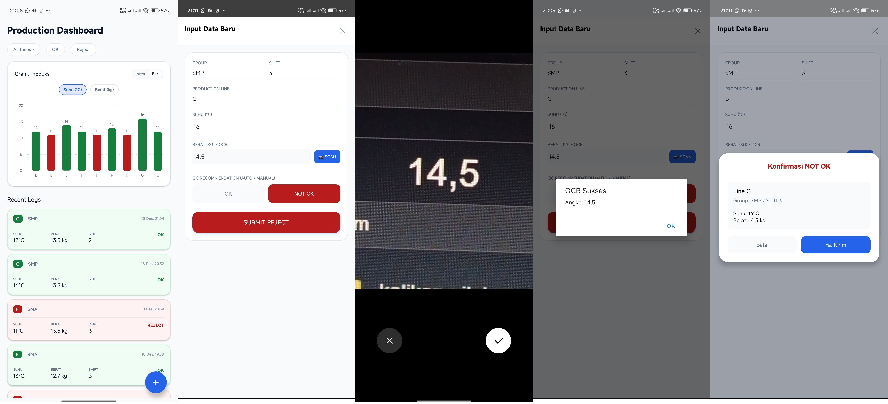

# Sistem Monitoring QC Produksi
Tampilan Web: <br> 
<br>
Tampilan Mobile: <br> 

## Tech Stack
* **Backend:** Node.js, Express.js, CORS, FS (File System).
* **Frontend Web:** Next.js (React), Tailwind CSS, Recharts.
* **Mobile:** React Native (Expo Framework), Expo Image Picker, React Native Gifted Charts.

## Prasyarat

Sebelum menjalankan, pastikan laptop sudah terinstall:
1.  **Node.js**
2.  **Aplikasi Expo Go** di HP Android 


## Panduan Instalasi & Menjalankan

### Langkah 1: Jalankan Backend (Server)
Buka terminal baru di folder `backend`:

```bash
cd backend
npm install
node server.js
```
Server akan berjalan di port 5000. Pastikan muncul pesan: `Server running on http://localhost:5000`

### Langkah 2: Jalankan Web Dashboard
Buka terminal baru (terminal kedua) di folder web:

```Bash
cd web
npm install
npm run dev
```
Buka browser dan akses: `http://localhost:3000`

### Langkah 3: Konfigurasi & Jalankan Mobile App
Buka file `mobile/app/index.tsx`.
Cari baris kode `API_URL`.
Cek IPv4 Address dari laptop anda, caranya dengan mengetik ini di terminal:
```bash
ipconfig
```
Ganti IP-nya dengan IPv4 Address laptop anda
```JavaScript
const API_URL = 'http://192.168.0.190:5000/api'; 
``` 
Buka terminal baru (terminal ketiga) di folder mobile:

```Bash
cd mobile
npm install
npx expo start
```
Scan QR Code yang muncul di terminal menggunakan aplikasi Expo Go di HP.